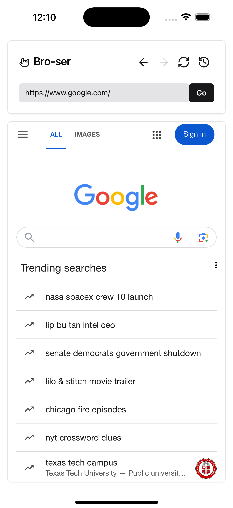

# Bro-ser - A Simple Web Browser for React Native



## Overview

Bro-ser is a lightweight web browser built with React Native and Expo. It provides a simple interface for browsing the web on both mobile devices and web platforms.

## Features

- Clean, minimalist UI with dark mode support
- URL input with validation
- Navigation controls (back, forward, refresh)
- Browsing history tracking
- Progress indicator for page loading
- Cross-platform support (iOS, Android, Web)

## Demo

Try the web version: [https://d32di3wh78k9b8.cloudfront.net/](https://d32di3wh78k9b8.cloudfront.net/)

## Technology Stack

- React Native
- Expo
- TypeScript
- NativeWind (TailwindCSS for React Native)
- Zustand (State Management)
- React Native WebView

## Getting Started

### Prerequisites

- Node.js (v14 or newer)
- npm or pnpm
- Expo CLI

### Installation

1. Clone the repository

   ```bash
   git clone https://github.com/yourusername/webviewerapp.git
   cd webviewerapp
   ```

2. Install dependencies

   ```bash
   pnpm install
   ```

3. Start the development server

   ```bash
   pnpm start
   ```

   This will open the Expo developer tools where you can run the app on:

   - iOS Simulator
   - Android Emulator
   - Web Browser
   - Physical device using Expo Go

## Project Structure

```
WebViewerApp/
├── app/                  # Main application screens
│   ├── _layout.tsx       # Root layout component
│   ├── history.tsx       # Browsing history screen
│   └── index.tsx         # Main browser screen
├── assets/               # Static assets
├── components/           # Reusable components
│   ├── ui/               # UI components
│   └── web-viewer/       # Web viewer specific components
├── lib/                  # Utilities and helpers
│   ├── icons/            # Icon components
│   ├── navigation-history.ts  # History state management
│   └── url-utils.ts      # URL handling utilities
└── ...                   # Configuration files
```

## Usage

1. Enter a URL in the address bar and press "Go" or hit Enter
2. Use the navigation controls to go back, forward, or refresh the page
3. Click the history icon to view your browsing history

## Platform-Specific Notes

- **Mobile (iOS/Android)**: Full functionality with WebView support
- **Web**: Some websites may not display due to X-Frame-Options restrictions. In these cases, an "Open in New Tab" option is provided.

## Contributing

Contributions are welcome! Please feel free to submit a Pull Request.

## License

This project is licensed under the MIT License - see the LICENSE file for details.

## Acknowledgments

- Built with Expo and React Native
- UI components inspired by shadcn/ui
